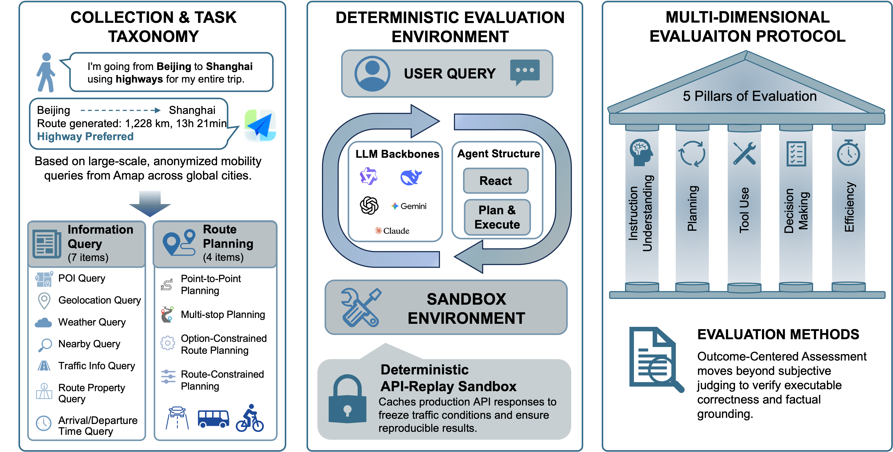

# MobilityBench: A Benchmark for Evaluating Route-Planning Agents in Real-World Mobility Scenarios

<div align="center">
Zhiheng Song¹, Jingshuai Zhang¹, Chuan Qin†, Chao Wang, Chao Chen, Longfei Xu, Kaikui Liu, Xiangxiang Chu, Hengshu Zhu†

<br>
AMAP, Alibaba Group

<br>

¹Equal contribution. &nbsp;&nbsp;&nbsp; †Corresponding authors.

<!-- [](https://arxiv.org/abs/2602.11664) -->
[](https://huggingface.co/datasets/GD-ML/MobilityBench/tree/main)


</div>

> **Note:** This work is currently under review. The full dataset will be released progressively.

## 📖 Overview

**MobilityBench** is a scalable benchmark for evaluating LLM-based route-planning agents in real-world mobility scenarios. It is built from large-scale, anonymized user queries collected from **Amap**, covering a wide range of route-planning intents across **multiple cities worldwide**.

To support **reproducible end-to-end evaluation**, MobilityBench includes a **deterministic API-replay sandbox** that removes environmental variance from live services. It also introduce a **multi-dimensional evaluation protocol** centered on **outcome validity**, complemented by evaluations of **instruction understanding**, **planning**, **tool use**, and **efficiency**. 


*Figure 1: Overview of MobilityBench, a systematic benchmark for evaluating route-planning agents.*

### Key Features

- **Multi-model evaluation**: Test multiple LLMs (OpenAI, Anthropic, Google, Qwen, DeepSeek) in parallel  
- **Comprehensive metrics**: Five evaluation dimensions covering instruction understanding, planning quality, tool use, answer accuracy, and efficiency  
- **Sandbox mode**: Offline evaluation with pre-cached API responses for fully reproducible results


## 🏗️ Architecture

MobilityBench supports two agent frameworks powered by LangGraph:

### Plan-and-Execute Framework (Default)

A **Planner-Worker-Reporter** architecture for structured task execution:

```
┌─────────────┐     ┌─────────────┐     ┌─────────────┐
│   Planner   │────▶│   Worker    │────▶│  Reporter   │
│  (Planning) │◀────│ (Execution) │     │  (Summary)  │
└─────────────┘     └─────────────┘     └─────────────┘
       │                   │                   │
       └───────────────────┴───────────────────┘
                           │
                    ┌──────┴──────┐
                    │  Tool Call  │
                    │ (Map APIs)  │
                    └─────────────┘
```

- **Planner**: Analyzes user requirements, creates structured plans, dynamically adjusts based on results
- **Worker**: Executes tool calls based on the plan, supports parallel task execution
- **Reporter**: Generates comprehensive natural language reports from execution results

### ReAct Framework

A **Reasoning-Action-Observation** loop for iterative problem solving:

```
┌─────────────────────────────────────────────┐
│                                             │
│  ┌──────────┐   ┌───────────┐   ┌─────────┐ │
│  │ Reasoning│──▶│  Action   │──▶│Observat.│ │
│  │ (Think)  │   │(Tool Call)│   │(Result) │ │
│  └──────────┘   └───────────┘   └────┬────┘ │
│       ▲                              │      │
│       └──────────────────────────────┘      │
│                                             │
└─────────────────────────────────────────────┘
```

- **Reasoning**: Analyzes current state and decides next action
- **Action**: Executes tool call or finishes task
- **Observation**: Processes tool results and feeds back to reasoning

## 📂 Dataset

MobilityBench dataset is collected from real-world anonymized user queries from **Amap**. We currently provide **sample data** for demonstration; the full dataset will be released progressively.

**Download:** [HuggingFace - MobilityBench](https://huggingface.co/datasets/GD-ML/MobilityBench/tree/main) -> place files into `data/datasets/`

#### Sample Data (5 Examples)

| Query | Task Scenario | Intent Family |
|-------|---------------|---------------|
| 去大石桥不走高速 | Option-Constrained Route Planning | Preference-Constrained Route Planning |
| 现在成都大道会堵车吗？看一下地图，会不会堵 | Traffic Info Query | Basic Route Planning |
| 我在哪 | Geolocation Query | Basic Information Retrieval |
| 知道离滇池会展中心有多远 | Route Property Query | Route-Dependent Information Retrieval |
| 到寨河收费站入口不走高速 | Option-Constrained Route Planning | Preference-Constrained Route Planning |

#### Data Format

| Field | Description |
|-------|-------------|
| `query` | User query text (Chinese) |
| `context` | Context information (JSON, e.g., current location, city) |
| `task_scenario` | Fine-grained task category |
| `intent_family` | Coarse-grained intent category for evaluation aggregation |
| `tool_list` | Expected tool calls (JSON array) |
| `route_ans` | Ground truth route answer (JSON) |

## 📊 Evaluation Metrics

MobilityBench proposes a **multi-dimensional evaluation protocol** that goes beyond end-to-end success rate, measuring an agent's capabilities across **Instruction Understanding, Planning, Tool Use, Decision Making, and Efficiency**.

### 1) Instruction Understanding

- **Intent Detection (ID)**  
  Measures whether the agent correctly identifies the query intent (one of the benchmark's scenario labels).  
  *Scoring:* label similarity >= threshold.

- **Information Extraction (IE)**  
  Measures whether the agent correctly extracts all constraints/slots from the query (e.g., origin/destination, time constraints, preferences).  
  *Scoring:* exact match between predicted and ground-truth constraint sets.

---

### 2) Planning

- **Task Decomposition (DEC)**  
  Measures whether the agent decomposes the task into an appropriate sequence of atomic actions. Reported as two metrics:
  - **DEC-P (Decomposition Precision / Coverage)**: proportion of ground-truth steps covered by predicted steps  
  - **DEC-R (Decomposition Recall / Redundancy complement)**: proportion of predicted steps that match ground-truth steps  
  *(Matching is determined by an action-level equivalence function.)*

---

### 3) Tool Use

- **Tool Selection (TS)**  
  Measures whether the agent selects the correct set of tools needed for the task. Reported as:
  - **TS-P (Tool Coverage)**: fraction of required tools selected
  - **TS-R (Non-redundancy / 1 - redundancy)**: penalizes unnecessary tool calls

- **Schema Compliance (SC)**  
  Measures whether tool/API calls conform to tool specifications (mandatory parameters present, types/formats/ranges valid).  
  *Scoring:* averaged compliance across all tool calls in an episode.

---

### 4) Decision Making (Outcome Quality)

- **Delivery Rate (DR)**  
  Percentage of queries where the agent produces a **complete, executable final output**, without interruption or tool invocation failure.

- **Final Pass Rate (FPR)**  
  Percentage of queries where the final solution **satisfies all explicit and implicit user constraints** (i.e., a valid final outcome).

---

### 5) Efficiency

- **Input Tokens (IT)**  
  Total tokens consumed as input context (system prompt + instructions + accumulated action/observation history).

- **Output Tokens (OT)**  
  Total tokens generated by the model (reflecting generation cost/latency trade-offs).

## 🚀 Getting Started

### 1. Install

**Requirements:** Python 3.12+, [uv](https://docs.astral.sh/uv/) (recommended) or pip

```bash
git clone https://github.com/your-org/mobility-bench.git
cd MobilityBench-main

# Install with uv (recommended)
uv sync

# Or install with pip
pip install -e .

# With evaluation dependencies
uv sync --extra eval
```

### 2. Configure Environment

Create a `.env` file with your LLM API credentials:

```bash
LLM_BASE_URL=https://api.openai.com/v1
LLM_API_KEY=your-api-key
```

### 3. Download Dataset

> **Note:** Before running, download the dataset from [HuggingFace](https://huggingface.co/datasets/GD-ML/MobilityBench/tree/main) and place the files into `data/datasets/`.

### 4. Run Benchmark

```bash
# Run benchmark with default settings (plan_and_execute framework)
mbench run --model gpt4.1 --dataset data/datasets/sample_10.csv

# Run with ReAct framework
mbench run --model gpt4.1 --framework react

# Run multiple models in parallel
mbench run --models gpt4.1,claude-opus-4-5 --parallel 4

# Enable sandbox mode (offline evaluation)
mbench run --model gpt4.1 --sandbox

# Resume an interrupted run
mbench run --model gpt4.1 --resume run_20260215_120000
```

### 5. Evaluate Results

```bash
# Evaluate a single run
mbench eval --run-id run_20260215_120000

# Evaluate with specific metrics
mbench eval --run-id run_20260215_120000 --metrics tool,answer,planning
```

### 6. Generate Reports

```bash
# Generate report (markdown / html / excel)
mbench report --run-id run_20260215_120000 --format excel

# Compare multiple runs
mbench report --run-id run_001 --compare run_002
```

## 💻 CLI Commands

| Command | Description |
|---------|-------------|
| `mbench run` | Run agent benchmark on dataset |
| `mbench eval` | Evaluate agent run results |
| `mbench report` | Generate evaluation reports |
| `mbench config` | Manage configuration files |
| `mbench version` | Show version information |

### Run Command Options

| Option | Description | Default |
|--------|-------------|---------|
| `--model, -m` | Model name to use | - |
| `--models` | Multiple models (comma-separated) | - |
| `--dataset, -d` | Dataset name or path | `mobility_6262` |
| `--framework, -f` | Agent framework (`plan_and_execute` or `react`) | `plan_and_execute` |
| `--config, -c` | Configuration file path | - |
| `--output-dir, -o` | Output directory | - |
| `--parallel, -p` | Parallelism level | `1` |
| `--sandbox/--live` | Use sandbox or live tools | `--sandbox` |
| `--resume` | Resume from run ID | - |
| `--dry-run` | Validate config only | `false` |

### Examples

```bash
# Show all available options
mbench --help
mbench run --help

# Run with custom configuration
mbench run --config configs/models/default.yaml --model qwen3-235b

# Initialize configuration templates
mbench config init --template full

# Validate configuration
mbench config validate --config configs/models/default.yaml
```

## ⚙️ Configuration

### Model Configuration

```yaml
# configs/models/default.yaml
models:
  gpt4.1:
    provider: openai
    base_url: ${LLM_BASE_URL}
    api_key: ${LLM_API_KEY}
    temperature: 0.1
    max_tokens: 8192
    roles:
      planner: gpt-41-0414-global
      worker: gpt-41-0414-global
      reporter: gpt-41-0414-global
```

### Environment Variables

| Variable | Description |
|----------|-------------|
| `LLM_BASE_URL` | Base URL for LLM API |
| `LLM_API_KEY` | API key for authentication |

## 📁 Project Structure

```
mobility-bench/
├── configs/                        # YAML configuration files
│   ├── agent/                      # Agent behavior settings
│   ├── datasets/                   # Dataset configuration
│   ├── evaluation/                 # Evaluation settings
│   └── models/                     # Model provider configs
├── data/
│   ├── datasets/                   # Benchmark datasets
│   ├── sandbox/                    # Cached API responses for replay
│   └── results/                    # Run outputs & evaluation results
├── src/mobility_bench/
│   ├── cli/                        # CLI commands (run / eval / report / config)
│   ├── agent/                      # Agent implementation
│   │   ├── graph/                  # LangGraph state & builder
│   │   ├── roles/                  # LLM manager & agent factory
│   │   ├── frameworks/             # Plan-and-Execute / ReAct
│   │   └── prompts/                # Prompt templates (CN & EN)
│   ├── tools/                      # Tool registry & sandbox implementations
│   ├── evaluation/                 # Evaluation engine & 5 metric modules
│   ├── dataset/                    # Dataset schema & loader
│   ├── runner/                     # Batch execution (sequential & parallel)
│   ├── reporting/                  # Report generators (MD / HTML / Excel)
│   ├── config/                     # Configuration management
│   └── utils/                      # Shared utilities
├── pyproject.toml
└── uv.lock
```

## 🤖 Supported Models

| Model | Provider |
|-------|----------|
| GPT-5.2 | OpenAI |
| GPT-4.1 | OpenAI |
| Claude-Opus-4.5 | Anthropic |
| Claude-Sonnet-4.5 | Anthropic |
| Gemini-3-Flash-Preview | Google |
| Gemini-3-Pro-Preview | Google |
| DeepSeek-V3.2-Exp | DeepSeek |
| DeepSeek-R1 | DeepSeek |
| Qwen3-4B | Alibaba |
| Qwen3-30B-A3B | Alibaba |
| Qwen3-32B | Alibaba |
| Qwen3-235B-A22B | Alibaba |
